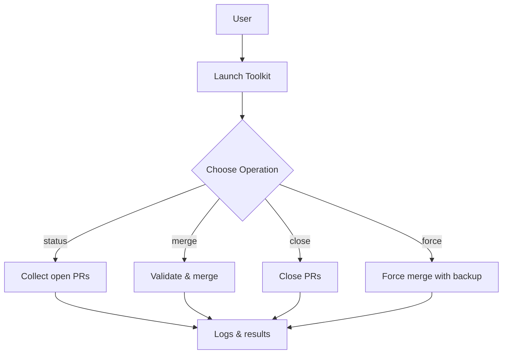

# GitHub PR Toolkit

Professional-grade PowerShell toolkit for managing pull requests across multiple repositories from a single Windows terminal. Built and maintained by GitHub engineers, the toolkit automates common PR workflows while enforcing safety checks and detailed audit trails.

## Features
- Discover all open pull requests authored by the authenticated user
- Bulk merge with validation of status checks, required reviews, and branch protections
- Close or force merge pull requests with interactive confirmation prompts
- Optional `-DryRun` mode to preview actions without modifying repositories
- Automatic backups and rollback logic for emergency force merges
- Extensive logging (`Logs/`) and machine-readable results (`Results/`)

## Typical Use Cases
- Review and merge dependency update PRs across many repositories
- Close stale or unwanted pull requests in bulk
- Force merge urgent fixes when CI or branch protections block standard merges
- Generate audit logs of PR activity for reporting

## Requirements
- Windows with PowerShell 5.1+ or PowerShell 7+
- GitHub personal access token with `repo` and `workflow` scopes

## Getting Started

### 1. Obtain a Token
Generate a classic token at <https://github.com/settings/tokens> with the scopes above. Keep the token secret.

### 2. Launch the Toolkit
Clone the repository and run the Windows wrapper script:

```powershell
git clone https://github.com/<your-org>/GitHub-PR-Toolkit.git
cd GitHub-PR-Toolkit
.\Pull-Request-Merger.ps1              # interactive menu
```

The script prompts for a token if `-GitHubToken` is not supplied.

### 3. Run an Operation
You can run operations through the menu or directly from the command line:

```powershell
.\Pull-Request-Merger.ps1 -Operation status          # list open PRs
.\Pull-Request-Merger.ps1 -Operation merge           # merge with safety checks
.\Pull-Request-Merger.ps1 -Operation close           # close PRs
.\Pull-Request-Merger.ps1 -Operation force -Force    # emergency force merge
```

Add `-DryRun` to any command to simulate the operation without changing anything.

## Flow Overview


Mermaid source for this diagram is available at `docs/workflow.mmd`.

## Repository Structure
```
├─ GitHub-PR-Toolkit.ps1       # Core toolkit script
├─ Pull-Request-Merger.ps1     # Windows launcher
├─ Logs/                       # Execution logs (auto-created)
├─ Results/                    # JSON results (auto-created)
├─ QUICK-START.md              # Additional quick start guide
├─ CONTRIBUTING.md
└─ LICENSE
```

## Contributing
We welcome contributions! Please review `CONTRIBUTING.md` and run PSScriptAnalyzer before submitting a pull request.

## License
MIT

